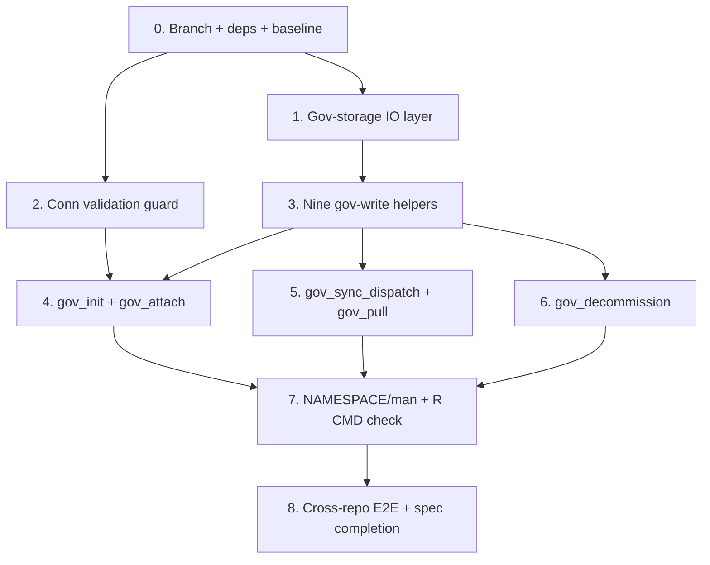

# Implementation Plan: GOV_SEAM Lift-Out (datomanager side)

## Overview

datomanager lands **second** (datom's side is already merged: datom 0.0.0.9001, with
`gov_backend` on every conn, decoupled `datom_init_repo()`, and the `datom_repo_*` /
`datom_storage_*` exports). These tasks build datomanager's governance write surface from the
bottom up: the gov-storage IO layer and conn guard first, then the nine native gov-write
helpers, then the five exported `gov_*` functions, then cross-repo E2E and `R CMD check`.

Derived from the contract's "Execution sequence" step 3 and design.md's Architecture /
Components. One task group = one commit; run the full `devtools::test()` suite before each
commit and report the count. Every intermediate state must keep `R CMD check` green.

**Pure separation (D2 / C7 / C8):** the nine helpers are **reimplemented natively** (git2r +
own storage IO), never copied from datom and never calling datom internals. The only
datomanager -> datom touchpoints are the conn fields (C6) and the exported `datom_repo_*` /
`datom_storage_*` functions (used by `gov_decommission`).

## Task Dependency Graph



```json
{
  "waves": [
    { "wave": 1, "tasks": ["0"] },
    { "wave": 2, "tasks": ["1", "2"] },
    { "wave": 3, "tasks": ["3"] },
    { "wave": 4, "tasks": ["4", "5", "6"] },
    { "wave": 5, "tasks": ["7"] },
    { "wave": 6, "tasks": ["8"] }
  ]
}
```

## Tasks

- [ ] 0. Branch, dependencies, baseline
  - Confirm work happens on `spec/gov-seam-liftout` (already created from `main`; carries the
    dev/README status refresh + the parked gov vignettes). Update the `dev/README.md` Active
    Specs row to "tasks started".
  - Confirm `datom` is installed at the post-lift-out version (>= 0.0.0.9001): the conn has
    `gov_backend`; `datom_repo_attach_governance` / `datom_repo_delete` are exported and
    `datom_attach_gov` / `datom_decommission` are gone.
  - `DESCRIPTION`: pin `Imports: datom (>= 0.0.0.9001)`; add the gov-write toolchain
    (`git2r`, `jsonlite`, `fs`, `glue`, `cli`, and `paws.storage` for the S3 backend) to
    `Imports`; add `hedgehog` to `Suggests` (property tests). `withr` + `mockery` already in
    `Suggests`.
  - Baseline: run `devtools::test()`, record the count (scaffold smoke test).
  - _Requirements: all (setup); C1.5_

- [ ] 1. Gov-storage IO layer (`R/utils-storage.R`)
  - Implement `.gov_resolve_namespace(conn)` -> `{gov_prefix stripped}/datom/` (or `datom/`
    when empty/NULL), per C8.1.
  - Implement `.gov_storage_write_json(conn, key, data)`, `.gov_storage_read_json(conn, key)`,
    `.gov_storage_delete_prefix(conn, prefix_key)` dispatching on `conn$gov_backend` (never
    inferred); abort if `gov_backend` is NULL.
  - S3 backend (`.gov_s3_*`): `conn$gov_client` `put_object`/`get_object`/list+delete; bucket
    = `conn$gov_root`; key = `{namespace}{key}`; content-type `application/json; charset=utf-8`.
  - Local backend (`.gov_local_*`): `{conn$gov_root}/{namespace}{key}` via `fs::dir_create` +
    `jsonlite::write_json`/`fromJSON`.
  - Serialization (C8.6): UTF-8, `auto_unbox = TRUE`, `pretty = TRUE`,
    `simplifyVector = FALSE` on read.
  - Tests `test-utils-storage.R`: round-trip on local backend; namespace resolution cases;
    backend dispatch. Property 1 (round-trip) and Property 7 (dispatch follows `gov_backend`)
    via `hedgehog::forall`, >= 100 iterations, tagged `# Feature: gov-seam-liftout, Property N`.
  - _Requirements: 1.5, 7.3, 7.5; C8; Properties 1, 7_

- [ ] 2. Conn validation guard (`R/utils-validate.R`)
  - Implement `.gov_validate_conn(conn)`: assert `inherits(conn, "datom_conn")` and presence
    of all twelve Conn_Interface_Contract fields; `cli_abort` naming the missing field(s);
    no side effects.
  - Tests: missing-field and wrong-class cases. Property 5 (invalid conn rejected without side
    effects) via `hedgehog` over lists missing 1+ of the 12 fields.
  - _Requirements: 2.8, 7.1; C6.6; Property 5_

- [ ] 3. Nine native gov-write helpers (`R/utils-gov.R`)
  - Inline git layer (git2r) on `conn$gov_local_path`, auth `git2r::cred_user_pass("git",
    conn$github_pat)`: pull (fetch+merge, abort on conflict), commit (stage+commit), push.
    Ensure local git identity on first interaction (set in `gov_init`).
  - The nine helpers, behavior-equivalent to the former datom helpers (names exactly):
    `.datom_gov_commit`, `.datom_gov_push`, `.datom_gov_pull`, `.datom_gov_write_dispatch`,
    `.datom_gov_write_ref`, `.datom_gov_register_project`, `.datom_gov_unregister_project`,
    `.datom_gov_record_migration`, `.datom_gov_destroy`. Internal; NOT in NAMESPACE.
  - Compound helpers: write file(s) to `projects/{name}/`, `.datom_gov_commit` (pull-first) ->
    `.datom_gov_push` -> mirror via `.gov_storage_write_json` (Task 1).
  - Commit messages byte-for-byte per C5 (`Register project {name}`, `Unregister project
    {name}`, `Update dispatch for {name}`, `Update ref for {name}`, `Record migration for
    {name}: {summary}`); literal substitution only.
  - Tests `test-utils-gov.R` over a local git clone (`helper-gov.R`): each helper's git +
    storage side effects; structural tests (all 9 defined, internal, absent from NAMESPACE;
    no `datom:::` in `R/`). Property 2 (commit-message audit) via `hedgehog`.
  - _Requirements: 1.1, 1.2, 1.3, 1.4, 1.6, 5.1, 7.2, 7.4; C3, C5, C7; Property 2_

- [ ] 4. `gov_init` + `gov_attach` (`R/init.R`, exported)
  - `gov_init(conn, gov_repo_url)`: validate conn; clone or reuse gov clone (validate remote
    URL on reuse); set local git identity; no commits/storage writes; idempotent;
    `invisible(conn$gov_local_path)`.
  - `gov_attach(conn)`: validate conn; abort if already registered (project dir exists, C2.7
    / Property 4); build initial `dispatch`, `ref` (from `conn$backend/root/prefix/region`),
    empty `migration_history`; `.datom_gov_register_project(...)` (commit "Register project
    {name}", push, mirror); `invisible(TRUE)`. Promotes Solo_Project -> Governed_Project.
  - roxygen `@export` on both.
  - Tests `test-init.R`: clone-or-reuse (matching/ wrong remote); attach creates the three
    objects in clone + storage (Property 3); double-attach rejected (Property 4).
  - _Requirements: 2.1, 2.2, 2.6, 2.7, 4.1, 4.2, 4.3; C5; Properties 3, 4_

- [ ] 5. `gov_sync_dispatch` + `gov_pull` (`R/sync.R`, exported)
  - `gov_sync_dispatch(conn, dispatch)`: validate; `.datom_gov_write_dispatch` (commit "Update
    dispatch for {name}", push, mirror); idempotent; `invisible(TRUE)`.
  - `gov_pull(conn)`: validate; `.datom_gov_pull` (fetch + ff merge); idempotent;
    `invisible(TRUE)`.
  - roxygen `@export` on both.
  - Tests `test-sync.R`: dispatch write round-trips to clone + storage; pull is a safe no-op
    when up to date.
  - _Requirements: 2.4, 2.5; C5_

- [ ] 6. `gov_decommission` (`R/decommission.R`, exported)
  - Validate; abort if project NOT registered. Data-side first (abort-on-failure): (a)
    `datom::datom_storage_delete_prefix(conn, "projects/{name}")`; (b)
    `datom::datom_repo_delete(conn, confirm = conn$project_name, force_gov_attached = TRUE)`.
    Then gov-side: (a) `.datom_gov_unregister_project` (commit "Unregister project {name}",
    push); (b) `.gov_storage_delete_prefix(conn, "projects/{name}")`. `invisible(TRUE)`.
  - Failure semantics: data-side failure -> abort, gov unchanged, error names the step
    (Property 6); gov-side failure after data-side -> error states data torn down but gov
    cleanup incomplete, names the step.
  - Never mutate the Data_Repo except via the exported `datom_*` calls (C4).
  - roxygen `@export`.
  - Tests `test-decommission.R`: `mockery::stub` the two `datom::` calls; assert call args,
    ordering, and both partial-failure error formats. Property 6 (data-side failure -> gov
    unchanged).
  - _Requirements: 2.3, 3.1-3.7, 7.1; C4; Property 6_

- [ ] 7. NAMESPACE / man / R CMD check
  - `devtools::document()`: export exactly the five `gov_*` functions; confirm no `datom_*` or
    other symbol is exported (C2.3); man pages generated.
  - `R CMD check --as-cran`: 0 errors, 0 warnings; the "Imports: datom not yet used" note
    clears (decommission references `datom::`); only a benign system-time note may remain.
  - _Requirements: 6.1, 6.2, 6.3; C2_

- [ ] 8. Cross-repo E2E + spec completion
  - Governed lifecycle E2E side-by-side: `gov_init -> gov_attach -> datom reads -> 
    gov_sync_dispatch -> gov_decommission` across the data/gov backend matrix (exercises
    `gov_backend`). Use a dev sandbox script; clean up artefacts.
  - Harvest learnings (gotchas -> datomanager engineering notes / `dev/`; conventions if any);
    update `dev/README.md` Active Specs to complete and Completed Phases. Refresh roadmaps.
  - Reconcile the `contract.md` mirror if anything changed (datom copy is source of truth).
  - PR `spec/gov-seam-liftout` -> `main`, merge, delete branch. Spec persists (not deleted).
  - _Requirements: 5.2, 5.3, 6.1; Synchrony (mirror reconciliation)_

## Notes

- **Starter reference (do NOT copy):** the pre-lift-out datom gov code (the five exports + nine
  `.datom_gov_*` write helpers + their tests) lives in datom history at the snapshot branch
  `pre-gov-lift-main-snapshot` (datom `6ea8dce`). Use it to confirm behavior-equivalence
  (argument names/order, return values, side effects, commit strings). It calls datom-internal
  git/storage utilities that C3 puts out of bounds, so the datomanager implementation is a
  native reimplementation, not a code move (D2).
- **C5 strings are the audit contract.** Never reformat them; literal `{name}`/`{summary}`
  substitution only. Property 2 guards this.
- **Backend is explicit (D3 / C6 / C8.8).** Always dispatch gov storage on `conn$gov_backend`;
  never infer from `conn$gov_client`.
- **No `datom:::` anywhere in `R/` (C3).** Cross-package calls only through exported
  `datom::datom_*()` symbols (only `datom_repo_delete` + `datom_storage_delete_prefix` are
  needed, in `gov_decommission`).
- **Tests run offline:** local git clone in `withr::local_tempdir()` + local storage backend;
  `mockery` for the datom data-side calls. Property tests use `hedgehog`, >= 100 iterations.
